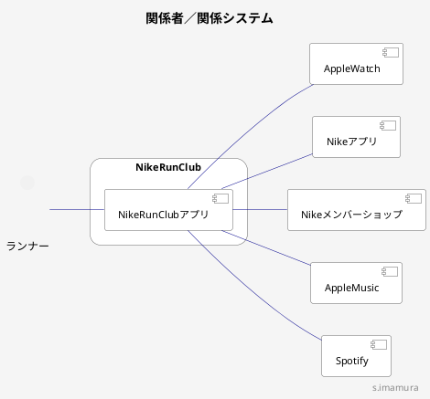

# モデリング練習

---
## 概要

#### 対象
**Nike Run Club**

走行距離の記録とフィットネスガイド

#### 参考URL
https://ui-pocket.com/apps/nike-run-club/

---

## モデリング

### 用語集／用語関連図（ドメインモデル図）

```plantuml
@startuml

' === ドキュメント設定 ===
right footer s.imamura
' mainframe mainframe
title 用語集／用語関連図
left to right direction
scale max 2048 width

' === スタイル ===
skinparam {
    ' === 共通設定 ===
    shadowing false
    ' linetype ortho
    backgroundColor whitesmoke
    arrow {
        color DarkBlue
        thickness 0.5
        fontSize 10
    }
    title {
        FontSize 14
        ' FontColor blue
        BorderThickness 10
        BorderColor transparent
    }

    ' === 要素別設定 ===
    rectangle {
        BackgroundColor business
        BorderColor #000
        RoundCorner 25
        BorderThickness 0.6
        fontColor black
        fontSize 14
    }
    actor {
        fontColor black
        fontSize 12
    }
    card {
        BorderColor #999999
        BorderThickness 0.6
        roundCorner 10
        fontColor black
        fontSize 12
    }
    collections {
        BorderColor #aaaaaa
        BorderThickness 0.5
        fontColor black
        fontSize 12
    }
    component {
        BackgroundColor white
        BorderThickness 0.5
        BorderColor #666666
        fontColor black
        fontSize 11
    }
    rectangle {
        BackgroundColor white
        BorderThickness 0.5
        BorderColor #666666
        fontColor black
        fontSize 11
    }
}

rectangle デバイス関連 {
  card 位置情報
  card 連携デバイス
}

rectangle アカウント関連 {
  card アカウント [
    アカウント
    --
    メールアドレス
    携帯電話番号
    単位
    国
    言語
    プライバシー設定
    プロフィール表示設定
  ]
  card ラン設定 [
    ラン設定
    --
    トラッキング設定
    オートポーズ設定
    音声フィードバック設定
    ランカウントダウン
    ラン開始時バイブ設定
    ラン開始時ロック設定
    画面の向き
    ランカラーレベル
  ]
  card ランナー [
    ランナー
    --
    性別
    体重
    身長
    プロフィール
  ]
  card ランナー歴

  アカウント -- ランナー
  ランナー -- ランナー歴
}

rectangle ラン関連 {
  card すべてのラン
  card 保存済みのラン

  card ラン [
    ラン
    --
    概要
    詳細
    時間
  ]
  card おすすめの音楽
  card 音声ガイドラン
  card ラン区分 [
    #ショートラン
    #イージーラン
    #スピードラン
  ]

  ラン <|-- ラン区分
  ラン -- おすすめの音楽
}


rectangle ワークアウト関連 {
  card ワークアウト [
    ワークアウト
    --
    タイトル
    目標距離
    日時
    ランの難易度
    インドア
    メモ
  ]

  collections ワークアウト一覧 [
    完了したワークアウト
  ]

  card ワークアウト走行距離
  card タイム
  card BPM
  card 平均心拍数
  card 最大心拍数
  card ペース
  card ペース表
  card 平均ペース
  card 目標ペース
  card 消費カロリー
  card "高低差（上り）" as 高低差上り
  card "高低差（下り）" as 高低差下り
  card ランコース
  card ランコース区分 [
    #道路
    #トラック
    #トレイル
  ]

  ' コレクション
  ワークアウト一覧 - ワークアウト

  ' 内部関連
  ワークアウト -- タイム
  ワークアウト -- BPM
  ワークアウト -- ペース
  ワークアウト -- 平均ペース
  ワークアウト -- 消費カロリー
  ワークアウト -- 高低差上り
  ワークアウト -- 高低差下り
  ワークアウト -- ランコース

  ランコース <|-- ランコース区分

  ' 外部関連
  ラン --- ワークアウト
}
rectangle スプリット関連 {
  card スプリット [
    スプリット
    --
    距離
    平均ペース
    高低差
  ]

  ' 外部関連
  ワークアウト --- スプリット
}

card 音楽サービス
card 音楽ソース

rectangle マイシューズ関連 {

  card シューズ [
    シューズ
    --
    ブランド
    カラー
  ]

  card マイシューズ [
    マイシューズ
    --
    ニックネーム
  ]
  collections マイシューズ一覧 [
    停止したシューズ
  ]
  card 履いて走る目標距離


  シューズ -- マイシューズ
  マイシューズ一覧 - マイシューズ
  マイシューズ -- 履いて走る目標距離
}

card プログラム
rectangle メッセージ関連  {
  card 受信トレイ
  card メッセージ [
    メッセージ
    --
    画像
    タイトル
    本文
    日時
  ]

  ' 内部関連
  受信トレイ -- メッセージ

  ' 外部関連
  アカウント --- 受信トレイ
}

rectangle プラン関連 {
  card プラン [
    プラン
    --
    概要
    頻度
    おすすめ対象
  ]
  card 週
  card 進捗
  card コース
  card ベース
  card コーチ [
    コーチ
    --
    名前
    出身地
    プロフィール
  ]
  card メニュー
  collections メニュー一覧 [
    今週のメニュー
  ]
  card ヒント
  collections ヒント一覧 [
    今週のヒント
  ]
  card 残り期間
  card トレーニングプランに関するFAQ
  card プログラムを終了する理由

  プラン -- 週
  プラン -- 進捗
  週 -- メニュー
  プラン -- プログラムを終了する理由
  プラン -- トレーニングプランに関するFAQ
  メニュー -- ヒント
  ヒント一覧 - ヒント
  メニュー一覧 - メニュー
  プラン -- コーチ

  ' 外部関連
  メニュー --- ラン
}

rectangle クラブ関連 {
  card クラブ
  card チャレンジ [
    チャレンジ
    ---
    名前
    距離
    作成者
    背景画像
  ]
  card 順位
  card ランキング
  card 友達
  card 友達リクエスト
  card 招待する友達
  card 合計走行距離
  card 開催期間 [
    開催期間
    --
    開始日
    終了日
    残り期間
  ]
  card 参加者
  card マイチャレンジ

}

rectangle アクティビティ関連 {
  card アクティビティ
  collections アクティビティ一覧 [
    最近のアクティビティ
  ]

  card トロフィー
  collections トロフィー一覧 [
    すべてのトロフィー
    最近獲得したトロフィー
  ]

  card ランレベル
  card 個人記録
  card 今月の走行距離
  card 連続記録

  ' 内部関連
  トロフィー一覧 - トロフィー
  アクティビティ一覧 - アクティビティ
}

card シェア
card コミュニティアクティビティ

card 投稿
card 友達
card イベント
card ショッピング

card NIKEタイムライン

rectangle ナイキメンバー関連 {
  card ナイキメンバー
  card ナイキメンバーの特典
  ナイキメンバー -- ナイキメンバーの特典
}


ナイキメンバー -- アカウント

@enduml

```

### 関係者／関係システム（システムコンテキスト図）

```plantuml
@startuml

' === ドキュメント設定 ===
right footer s.imamura
' mainframe mainframe
title 関係者／関係システム
left to right direction
scale max 2048 width

' === スタイル ===
skinparam {
    ' === 共通設定 ===
    shadowing false
    ' linetype ortho
    backgroundColor whitesmoke
    arrow {
        color DarkBlue
        thickness 0.5
        fontSize 10
    }
    title {
        FontSize 14
        ' FontColor blue
        BorderThickness 10
        BorderColor transparent
    }

    ' === 要素別設定 ===
    rectangle {
        BackgroundColor business
        BorderColor #000
        RoundCorner 25
        BorderThickness 0.6
        fontColor black
        fontSize 14
    }
    actor {
        fontColor black
        fontSize 12
    }
    card {
        BorderColor #999999
        BorderThickness 0.6
        fontColor black
        fontSize 12
    }
    component {
        BackgroundColor white
        BorderThickness 0.5
        BorderColor #666666
        fontColor black
        fontSize 11
    }
    rectangle {
        BackgroundColor white
        BorderThickness 0.5
        BorderColor #666666
        fontColor black
        fontSize 11
    }
}

' 登場人物
actor ランナー

' システム
rectangle NikeRunClub {
  component NikeRunClubアプリ
}

' 外部システム
component AppleWatch
component Nikeアプリ
component Nikeメンバーショップ
component AppleMusic
component Spotify

' 関係
ランナー -- NikeRunClubアプリ

NikeRunClubアプリ -- AppleWatch
NikeRunClubアプリ -- Nikeアプリ
NikeRunClubアプリ -- Nikeメンバーショップ
NikeRunClubアプリ -- AppleMusic
NikeRunClubアプリ -- Spotify

@enduml

```

---

