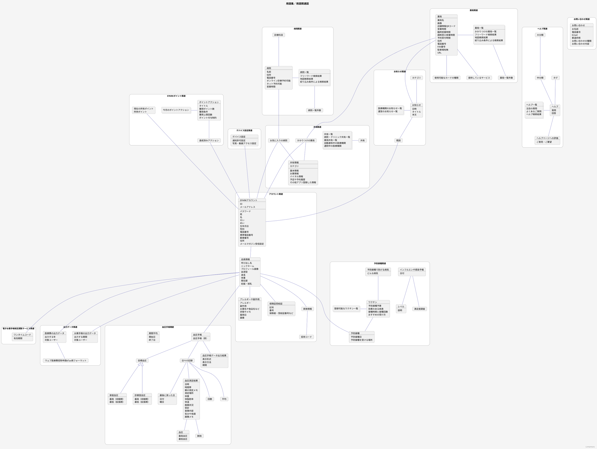

# モデリング練習

---
## 概要

#### 対象
**お薬手帳**

ポイントが貯まる！ワクチン接種記録や血圧手帳など機能多数

#### 参考URL
https://ui-pocket.com/apps/okusuritecho/

---

## モデリング

### 用語集／用語関連図（ドメインモデル図）

---

### 他サービス

- 電子お薬手帳相互閲覧サービス
- マイナポータル
  - 予防接種情報

---

### 気になったこと

- 「現在の所有ポイント」と「所持ポイント」は同義か？
- 「ポイント」は全て「EPARKポイント」と同義か？
- 「お薬手帳ポイント一覧」の"一覧"とは何の一覧か？
- 「今月のポイントアクション」と「今月獲得できるポイント」は同義か？
- ポイントの単位は「pt」と「ポイント」で同義か？
- 「登録済みの病院」と「お気に入りの病院」は同義か？
- 「使用可能なカードの種類」が「0」表記となるケースがあるが、想定通りか？
- 「提供しているサービス」という見出しが重複しているが、想定通りか？
- 「施設」と「医療機関」は同義か？
- 「出力する期間」と「出力する年」は同義か？
