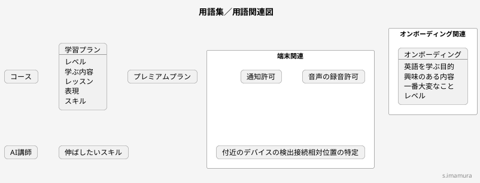

# モデリング練習
---
## 概要
#### 対象
**speak**
いつでも練習できるAI英語学習
#### 参考URL
- https://ui-pocket.com/apps/speak/
- https://play.google.com/store/apps/details?id=com.selabs.speak
---
## モデリング
### 用語集／用語関連図（ドメインモデル図）

---
### 他サービス
-
---
### 気になったこと
