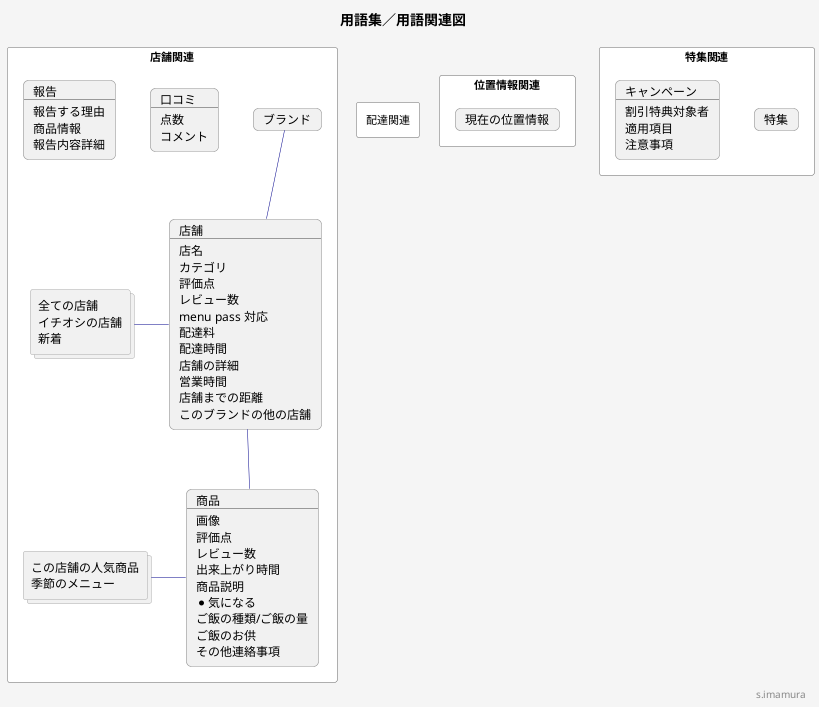

# モデリング練習
---
## 概要
#### 対象
**menu**
料理・食料品・日用品を配達！
#### 参考URL
https://ui-pocket.com/apps/menu/
---
## モデリング
### 用語集／用語関連図（ドメインモデル図）

```plantuml
@startuml
' === ドキュメント設定 ===
right footer s.imamura
title 用語集／用語関連図
' left to right direction
scale max 2048 width
' === スタイル ===
skinparam {
    ' === 共通設定 ===
    shadowing false
    ' linetype ortho
    backgroundColor whitesmoke
    arrow {
        color DarkBlue
        thickness 0.5
        fontSize 10
    }
    ' === 要素別設定 ===
    card {
        BorderColor #999999
        BorderThickness 0.6
        roundCorner 10
        fontColor black
        fontSize 12
    }
    collections {
        BorderColor #aaaaaa
        BorderThickness 0.5
        fontColor black
        fontSize 12
    }
    rectangle {
        BackgroundColor white
        BorderThickness 0.5
        BorderColor #666666
        fontColor black
        fontSize 11
    }
}

rectangle 位置情報関連 {
  card 現在の位置情報
}

rectangle 店舗関連 {
  collections 店舗一覧 [
    全ての店舗
    イチオシの店舗
    新着
  ]
  card 店舗 [
    店舗
    --
    店名
    カテゴリ
    評価点
    レビュー数
    menu pass 対応
    配達料
    配達時間
    店舗の詳細
    営業時間
    店舗までの距離
    このブランドの他の店舗
  ]
  card ブランド
  collections 商品一覧 [
    この店舗の人気商品
    季節のメニュー
  ]
  card 商品 [
    商品
    --
    画像
    評価点
    レビュー数
    出来上がり時間
    商品説明
    *気になる
    ご飯の種類/ご飯の量
    ご飯のお供
    その他連絡事項
  ]
  card 口コミ [
    口コミ
    --
    点数
    コメント
  ]

  card 報告 [
    報告
    --
    報告する理由
    商品情報
    報告内容詳細
  ]

  ' コレクション
  店舗一覧 - 店舗
  商品一覧 - 商品

  ' 内部関連
  ブランド -- 店舗
  店舗 -- 商品
}

rectangle 配達関連 {
}


rectangle 特集関連 {
  card 特集
  card キャンペーン [
    キャンペーン
    --
    割引特典対象者
    適用項目
    注意事項
  ]
}


@enduml
```
---
### 他サービス
-
---
### 気になったこと
