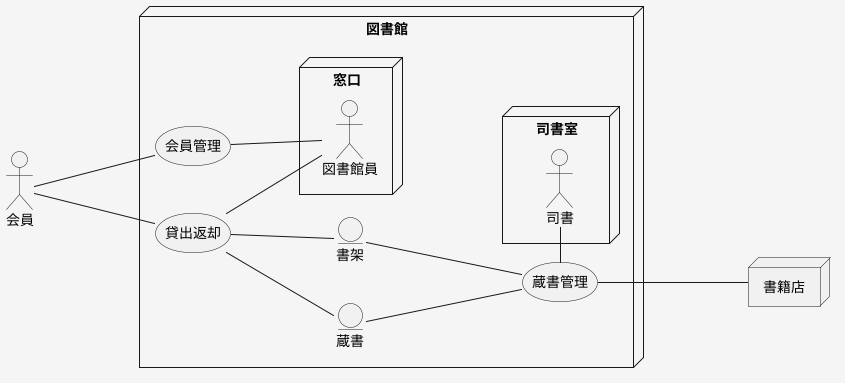

# ビジネスコンテキスト図

## 概要

システム化対象のビジネスをイメージできるリッチピクチャーが「ビジネスコンテキスト図」になります。このリッチピクチャー上に最上位のビジネスの単位となるものを「業務」アイコンで示し、システム化対象の最上位のビジネス単位を明らかにシマス。さらに業務にかかわるビジネス要素を洗い出し、「バリエーション」と「情報」を抽出する源泉とします。

## 役割
「ビジネスコンテキスト図」で表現したいのは、トップダウンで分析するための出発点となる「業務」を洗い出すことと、ビジネスルールに関わるビジネス要素を明示することです。

## 構成要素

### 業務

ビジネス上認識されているトップレベルの一塊の仕事で、モデル要素として管理されるものです。「業務」アイコンの粒度はあくまで相対的なもので、絶対的に決まっている粒度ではありません。。洗い出した「業務」アイコンを見比べて同じような粒度間になるよう調整しましょう。
「業務」はこのダイアグラムだけで決まるものではなく、「ビジネスユースケース」とのかかわりの中で適切なものを洗い出します。

### ビジネス要素

「業務」関わるものを配置します。RDRAとして事前に定義しているものはありませんが、一般的に以下の要素が通常現れます。
取引先、商品、倉庫、在庫、金融商品、物流、サービス、...
関わる表疎は多岐にわたりますが、「ビジネスユースケース」の違いを生み出すものを中心に洗い出します。
ビジネス要素はバリエーションの洗い出しや、「情報」を洗い出すきっかけになるものです。全くの白紙の状態から「バリエーション」や「情報」を洗い出すのは大変ですが、ビジネス要素があれば、それを頼りに「バリエーション」や「情報」を素早く整理することができます。
ビジネス要素は様々な物が現れる可能性があり、モデルの種類が増えすぎて管理が大変になるので、モデル要素としては扱いません。

## なにを描かなければならないのか

トップレベルの業務を明らかにし、その業務に関わるビジネス要素を洗い出します。

## 何を書いてはいけないのか

関連線は「業務」とビジネス要素を結び、線だらけになってしまうのでビジネス要素間を関連線で結びません。

## このダイアグラムで合意すること

- 全体としていくつ「業務」があるのかが明確になっていること
- 各「業務」の粒度間は適切か、大きすぎたり小さすぎたりしていないか、各「業務」が横並びにして違和感がないか
- 「業務」の内容を表す「ビジネスユースケース」の違いがでる事柄（商品、取引先、取引方法～）がビジネス要素として含められているか

## サンプル

- 「会員管理」業務は図書館窓口が会員の管理を行う
- 「貸出・返却」業務は図書館窓口が会員に対してほんの貸出と返却を行い、その時に蔵書と初夏に関わることを表す
- 「蔵書管理」業務は図書館司書が蔵書の管理とその蔵書がある書架の管理を行う

