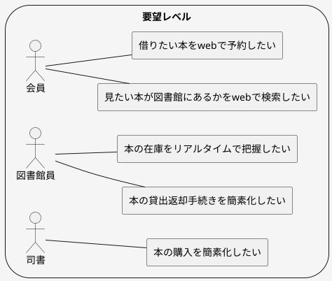
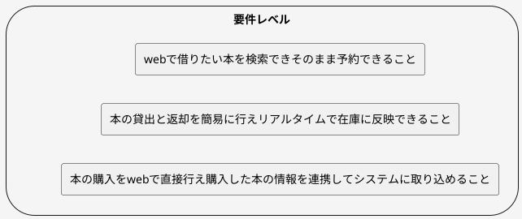

# 要求モデル図
## 概要
要求モデル図は、システム開発の初期段階で重要な要求を整理し、実現すべき要件を明確にするためのダイアグラムです。プロジェクトの成功には、重要な要求を洗い出すことが不可欠ですが、その過程で枝葉末節の要望に囚われないように注意が必要です。要求モデル図を使用することで、重要な要求を整理し、システム化の方向性を見出すことができます。

## 役割
要求モデル図の役割は、重要な要求を整理し、実現すべき要件を明確にすることです。また、重要なステークホルダーの要求を把握していることも重要です。最終的には、要件がテストシナリオのインプットになることを目指します。

## 構成要素
### 要求
初期の要求は、粒度がバラバラであり、雑多なレベルのものがほとんどです。そのため、要求を「要望」「要求」「要件」の３つの種類に分類することで、見通しが良くなります。要望はできたらいいと思うレベルのものであり、要求は検討対象として合意されたものです。要件は、システムで実現する必要があるもので、「XXXできること」として表現します。

初期要求は、ToBeの姿が明確になっていない段階での要望であるため、時間を無駄にすることがあります。重要な要求だけを残し、その他の要望を捨てることで、効率的に整理することができます。

### アクター
初期の要求一覧には、要求元として「アクター」を要求に結び付けます。すべての要求に対応する「アクター」を洗い出すのではなく、重要なステークホルダーの要求を抑えているか否かを確認することが目的です。プロジェクトの進行中に、重要なステークホルダーの要求を把握していない場合に、深刻な問題が発生することがあります。そのため、重要なアクターの要求を把握することは、最低限必要です。アクターは「システムコンテキスト図」で洗い出したものを使用します。要求モデルで新たに洗い出したアクターは、システムコンテキスト図に追記して、システム全体のコンテキストを洗い直します。

## 導出
要求モデルは大きく２段階に分けて作成します。まず初期の要求一覧から重要な要求を洗い出しシステム化の方向性を明確にシマス。次に重要な要求から具体的な要件として整理します。
２段階に分ける理由は、重要な要求を短時間で見極め、具体的な要件は他のモデルを作成しながら洗い出すからです。こうすることであまり時間をかけずに重要な要件を明示することができます。

## 何を描かなければならないのか

初期要求にはアクターを紐づけ重要なステークホルダーの要求を把握し、重要な要求を対象に分析を行い、粒度のそろった要件を記述します。

## 何を描いてはいけないのか

システムの要件は要件定義の中で明確になるので、初期段階の要望や枝葉の要求は捨てて、重要な要求・課題の分析に時間を割きます。さらに要求や、要件を網羅的に出そうとしてはいけません。時間ばかりがかかり効果が薄いからです。あくまでも関係者の合意事項としてまとめるレベルにとどめます。そうしないといつまでたっても終わらなくなります。

## このダイアグラムで合意すること

このシステムで実現しなくてはいけない重要な要件を合意し、最終的にシステム化の目的をシステムコンテキスト図に記述します。

## サンプル

## まとめ
要求モデル図は、システム開発において要求の整理と実現する要件を明確化するためのツールです。初期の要求一覧から重要な要求を選び出し、アクターとの関係性を整理することで、システム化の方向性を明らかにすることができます。また、関係性を整理することで要求の優先度や依存関係を明確にし、漏れや不適切な要求を発見することができます。プロジェクトの進捗状況に応じて、要求モデル図を改定することが必要です。
