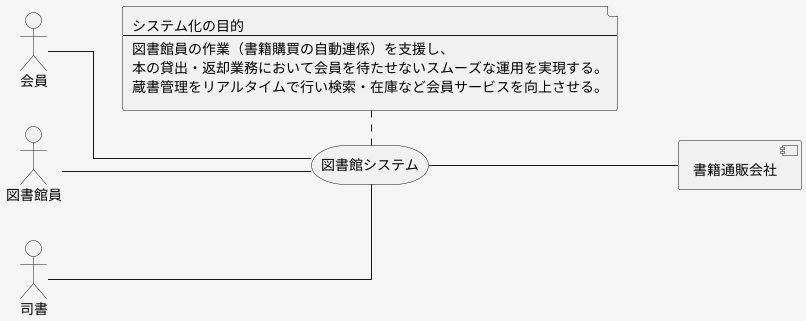

# システムコンテキスト図

## 概要
要件定義の最初の時点でプロジェクトの認識を合わせるために作成するのが、「システムコンテキスト図」になります。非常に簡素なダイアグラムなので有効性に疑問を持つ方もいますが、プロジェクトの開始当初は関わるアクターと外部システムの認識が異なることが少なくありません。ここの認識が違えば業務や機能、画面の認識に相当違いが出てきます。まずは基本的な部分の認識を合わせ、システム化のスコープをトップレベルで合意します。

## 役割
効果や価値を明確にするためには、まずシステムに関わる人や外部システムを把握する必要があります。それらを一枚で俯瞰できるようにしたのが「システムコンテキスト図」です。
まずは要件定義メンバーで思いつくものをいったん洗い出し、最初の認識合わせを行います。あとは他のダイアグラムを作成する中でアクターや外部システムを洗い出します。

## 何を書かなければいけないのか

システム化スコープを決めるにあたって、アクターと外部システムが大きくかかわるので、その認識を合わせるために作成シマス。同時に要件定義やその後の詳細な仕様を決める判断基準となる目的を明らかにします。

## なにを描いてはいけないのか

関わるアクター、外部システムを全て洗い出す目的で子のダイアグラムを作成してはいけません。
大量にある場合は一覧表などで表現します。このダイアグラムには価値を提供する重要なアクターと外部システムを洗い出すことに注力します。

## このダイアグラムで合意すること
以下の3つを合意します。
- 価値を提供するアクター、それを支援するアクターを合意する
- 価値を提供する外部システムを合意する
- システム化の目的を合意する

## 構成要素

### システム化の目的

要求を分析し重要な要求からシステム化の目的を検討し簡潔にまとめます。
「お金をかける以上はこれができなければ意味がない」という何をおいても実現しなくてはいけないことを記述シマス。プロジェクト期間中いつでも目的に立ち返ることができるように一言で簡潔にまとめます。洗い出したアクターや外部システムにどのような価値を届けるのかを出発点にして考えると収まりが良くなります。
基幹システムの再構築案件などでは「今更目的も代だろう、今動いているものを作り直すんだ」ということで、ほとんど目的は意識サレマセン。しかし、基幹システムは今後企業が存続していく限り再構築され続けていくもので、その時代に合わせた変化が求められます。その変化をテーマと捉え目的に置き換えて考えます。「今の時代に必要とされるシステム化のテーマは何か」を目的とします。

目的は意思決定の最上位の判断基準なので、これが定まると意思決定が早まります。複数の案があった時にも目的に一番沿ったものにすれば、判断に迷いがなくなります。したがって、地味ですが目的を決めるのはとても重要なことです。
システム化の目的はプロジェクトの最初の、記述しなくてもかまいません。要求を分析し、ビジネスユースケース、ユースケースが明らかになる中で明確にしていきます。

### アクター

システムから価値を得る人とそのために関わる人を示します。例えば一般的に顧客は価値を与える「アクター」になります。まずは価値を与える「アクター」を優先して洗い出し、価値を提供する「アクター」は「業務フロー図」を作成する中で洗い出されたものを追記します。
アクター名はロール名とします。また、関わる「アクター」が多い場合は重要なもの、価値を与えるものを中心に記述シマス。アクターを洗い出す目的は「誰のためにどのような価値を提供するシステムにするか？」を考えることなので、関わるすべてのアクターを洗い出すことにより、価値に結び付く重要なアクターを洗い出すことを最優先します。

最初からアクターを決定しようとせず、徐々に洗練化する中で整理します。最終的にシステムに関わるアクターがシステム化のスコープに大きく影響するので、開発スコープを調整する中でもアクターは変わっていきます。

### 外部システム

当該システムに関係するシステムで、このプロジェクトで手を入れられないシステムは「外部システム
」となります。価値を与える、もしくは価値を得る外部システムを洗い出します。
例えば、顧客に対して出荷情報を連携するのは価値を与えているので、相手のシステムを「外部システム」として洗い出します。また、非常に魅力的なサービスを提供している外部システムを利用することで価値を提供する場合にも記述します。例えば、地図を使った革新的なインターフェースが売りの場合は、他者の地図サービスを提供しているシステムを外部システムとして記述シマス。ただし、外部のサービスを利用するだけで価値と関わりがない場合は、ここに記述しません。まずは関係ありそうなシステムを「外部システム」としていったんあげ、他のダイアグラムを作る中で、重要か否かで見直していきます。

## サンプル

